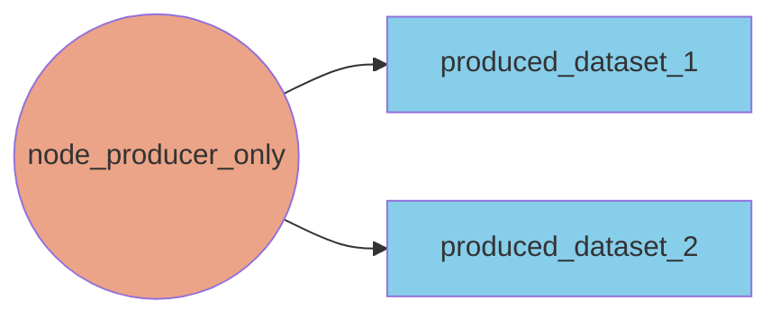
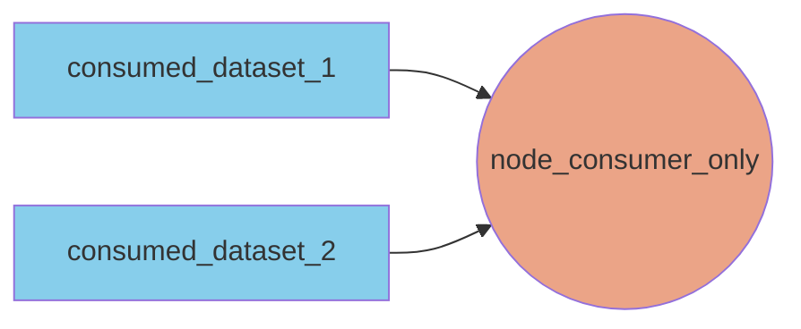
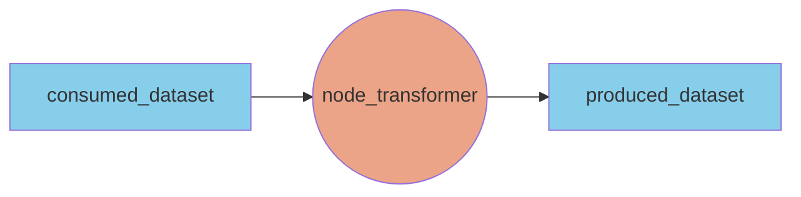

# Building a Node

Nodes are essentially units of compute that encapsulate any event-driven logic you can define in python. Whether it is a transformation, an API call or a data transfer, as long as you can express it in python, it can be contained in a node!

## Implementing a Node

```
from aineko.config import AINEKO_CONFIG
from aineko.internals.node import AbstractNode

class TestSequencer(AbstractNode):
    """Test sequencer node."""
    ...
```

**Pre-Loop Hook**

You can optionally define a `_pre_loop_hook` method in your node class to intialize the state of your node with class variables. The `_pre_loop_hook` method consumes params that are provided in the pipeline configuration, so you can define the initial state of your node via your pipeline config.

```
def _pre_loop_hook(self, params: dict = None):
    """Pre loop hook."""
    self.cur_integer = int(params.get("start_int", 0))
    self.num_messages = 0
```

**Execute Method**

The `_execute` method of the node is wrapped by the `execute` method in the `AbstractNode` base class. The `_execute` method is called constantly in a while loop. The loop only terminates based on the strategy provided to the `NodeManager` (executes as an infinite loop by default) or by the user returning False from the `_execute` method. Nodes work best when they are constantly polling for new data from consumers or from outside systems and taking actions depending on the data that is consumed.

```
def _execute(self, params: dict = None):
    """Generates a sequence of integers and writes them to a dataset.
    Args:
        params: Parameters for the node
    Returns:
        None
    """
    # Break if duration has been exceeded
    if self.num_messages >= params.get("num_messages", 25):
        return False
    ...
```

**Producers & Consumers**

Node classes inherit attributes named `self.producers` and `self.consumers` that are each a dictionary, keyed by dataset name with values being `DatasetProducer` and `DatasetConsumer` objects, respectively. These objects allow you to produce/consume data to/from a dataset from your catalog config.

```
def _execute(self, params: dict = None):
    """Generates a sequence of integers and writes them to a dataset.
    Args:
        params: Parameters for the node
    Returns:
        None
    """
    # Break if duration has been exceeded
    if self.num_messages >= params.get("num_messages", 25):
        return False

    # Write message to producer
    self.producers["integer_sequence"].produce(self.cur_integer)
    self.log(f"Produced {self.cur_integer}", level="info")
    self.num_messages += 1

    # Increment integer and sleep
    self.cur_integer += 1
    time.sleep(params.get("sleep_time", 1))
```

The producers and consumers you use in your node must be made available to your node via the pipeline configuration. If a dataset is not available in a Node's catalog, a `KeyError` will be raised.

A node can produce to a dataset, consume from a dataset, or both. Nodes that consume are triggered to action by the arrival of new data in the dataset they consume from. 

Below is a node that only produces to two datasets, and acts like a source for datasets:


The next node only consumes from two datasets, and acts like a sink for datasets:


A node that both consumes and produces datasets acts like a transformer for datasets. The consumed datasets are the inputs to the transformer, and the produced datasets are the outputs of the transformer:

**Logging**

Node classes inherit a method named `self.log` that allows users to log messages to Amber, where logs are aggregated and triaged across observability pipelines. You can set the appropriate level from: `info`, `debug`, `warning`, `error`, an `critical`.

```
self.log(f"Produced {self.cur_integer}", level="info")
```

You can log from inside of the `_pre_loop_hook` method, the `_execute` method, or any other method you add to your node.
