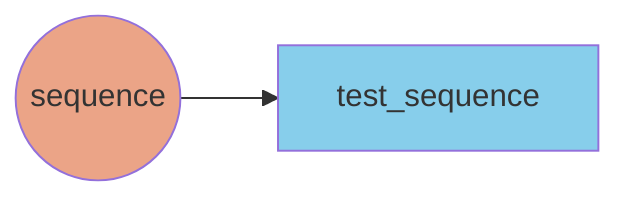

# Building a Pipeline

At a high-level, building a pipeline requires defining a pipeline and implementing at least a node.

## Defining a pipeline


For the sake of simplicity, we reference a truncated version of the pipeline definition below:
```yaml
pipeline:
  name: test-aineko-pipeline

  default_node_settings:
    num_cpus: 0.5

  nodes:
    sequence:
      class: my_awesome_pipeline.nodes.MySequencerNode
      outputs:
        - test_sequence
      node_params:
        initial_state: 0
        increment: 1


  datasets:
    test_sequence:
      type: kafka_stream

```

## Pipeline Configuration

A pipeline configuration `yml` file should have the following schema:

* **`name`** - name of the pipeline
* **`default_node_settings (optional)`**
    * **<parameter\>** - Any of the parameters that are passed to [ray actor options](https://docs.ray.io/en/latest/ray-core/api/doc/ray.remote.html#ray.remote) (e.g. `num_cpus`)
* **`nodes`**
  * **<name of node\>**
    * **`class`** - python class to run
    * **`inputs` (optional)** - dataset(s) to consume from if applicable, should exist in the `datasets` block
    * **`outputs`(optional)** - dataset(s) to produce to if applicable, should exist in the `datasets` block
    * **`node_params`(optional)** - define any arbitrary params relevant for node's application logic, these are passed as a dictionary into the `params` argument found in the nodes
    * **`node_settings`(optional)** - parameters that are passed to [ray actor options](https://docs.ray.io/en/latest/ray-core/api/doc/ray.remote.html#ray.remote), will override the ones set in `default_node_settings`
* **`datasets`**
    * **<name\_of\_dataset\>**
        * **`type`** - only `kafka_stream` is supported right now, which maps to a kafka topic

!!! note
    Aineko is currently in the Beta release stage and is constantly improving.

    If you have any feedback, questions, or suggestions, please [reach out](mailto:support@aineko.dev) to us.
