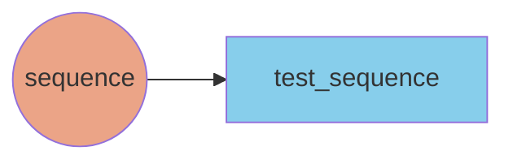

# Pipeline configuration

At a high-level, building a pipeline requires defining a pipeline and implementing at least a node.

## Defining a pipeline

The simplest possible pipeline would consist of a node and a dataset as shown below.


For the sake of simplicity, we reference a truncated version of the pipeline definition:

???+ example "Example `pipeline.yml` configuration file"
    ```yaml
    pipeline:
      name: test-aineko-pipeline

      default_node_settings:
        num_cpus: 0.5

      nodes:
        sequence:
          class: my_awesome_pipeline.nodes.MySequencerNode
          outputs:
            - test_sequence
          node_params:
            initial_state: 0
            increment: 1


      datasets:
        test_sequence:
          type: kafka_stream

    ```

A pipeline definition should have the following attributes:

## Keys

### `pipeline`

This is the top-level key in a pipeline configuration file, a configuration map to define the name, default settings, nodes, and datasets for a pipeline.

| Key                     | Required | Type   | Description                                                                                  |
| ----------------------- | -------- | ------ | -------------------------------------------------------------------------------------------- |
| `name`                  | Y        | string | Name of the pipeline.                                                                        |
| `default_node_settings` | N        | map    | Defines common default values for node attributes which can be overridden at the node level. |
| `nodes`                 | Y        | map    | Defines the compute nodes for a pipeline, mapping to node names.                             |
| `datasets`              | Y        | map    | Defines the compute nodes for a pipeline, mapping to structs with node name keys.            |


#### `default_node_settings`

This optional section can be used to set common default settings for all nodes in the pipeline. These settings are passed into [ray actors](https://docs.ray.io/en/latest/ray-core/actors.html) as parameters, and accept any of the arguments found [here](https://docs.ray.io/en/latest/ray-core/api/doc/ray.remote.html#ray.remote). The most common one we usually use is `num_cpus`.


| Key         | Required | Type     | Description                                                                                                    |
| ----------- | -------- | -------- | -------------------------------------------------------------------------------------------------------------- |
| `<setting>` | N        | multiple | Any of the parameters found [here](https://docs.ray.io/en/latest/ray-core/api/doc/ray.remote.html#ray.remote). |
| `num_cpus`  | N        | float    | Defines default number of CPUs for a node. Can be less than one.                                               |


These can be overridden at the node level.

#### `nodes`

This section defines the compute nodes for a pipeline.

| Key              | Required | Type | Description                                                   |
| ---------------- | -------- | ---- | ------------------------------------------------------------- |
| `<name of node>` | Y        | map  | Defines map of node names to node structures in the pipeline. |

##### `<node_name>`

A particular node instance in the pipeline, defined by a unique name. Any parameters defined at the individual node level will locally overwrite any default settings defined at the `default_node_settings` level.

| Key           | Required | Type            | Description                                                                                                                                                           |
| ------------- | -------- | --------------- | --------------------------------------------------------------------------------------------------------------------------------------------------------------------- |
| `class`       | Y        | string          | Python module to run for the node.                                                                                                                                    |
| `inputs`      | N        | list of strings | Defines which datasets to consume from if applicable.                                                                                                                 |
| `outputs`     | N        | list of strings | Defines which datasets to produce to if applicable.                                                                                                                   |
| `node_params` | N        | map             | Defines any arbitrary parameters relevant for node's application logic. In the example above, we defined `initial_state` and `increment` parameters, which are both integers. |
| `num_cpus`    | Y        | float           | Number of CPUs allocated to a node. Required either for each node definition or at `default_node_settings` level.                                                     |


#### `datasets`

This section defines the datasets for a pipeline.

| Key                 | Required | Type | Description                                                         |
| ------------------- | -------- | ---- | ------------------------------------------------------------------- |
| `<name of dataset>` | Y        | map  | Defines map of dataset names to dataset structures in the pipeline. |

##### `<name of dataset>`

A particular dataset instance in the pipeline, defined by a unique name. Each dataset is defined by a type.

| Key    | Required | Type   | Description                                                                        |
| ------ | -------- | ------ | ---------------------------------------------------------------------------------- |
| `type` | Y        | string | Defines which type of dataset to use. Currently, only `kafka_stream` is supported. |

!!! note
    Aineko is currently in the Beta release stage and is constantly improving.

    If you have any feedback, questions, or suggestions, please [reach out](mailto:support@aineko.dev) to us.
