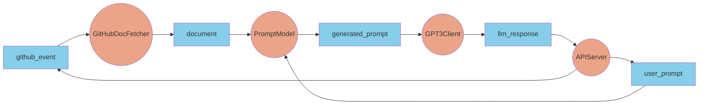
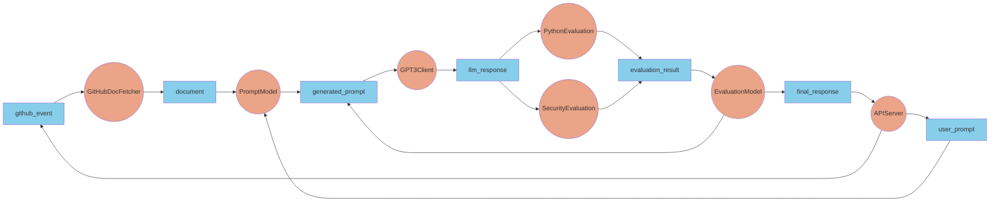
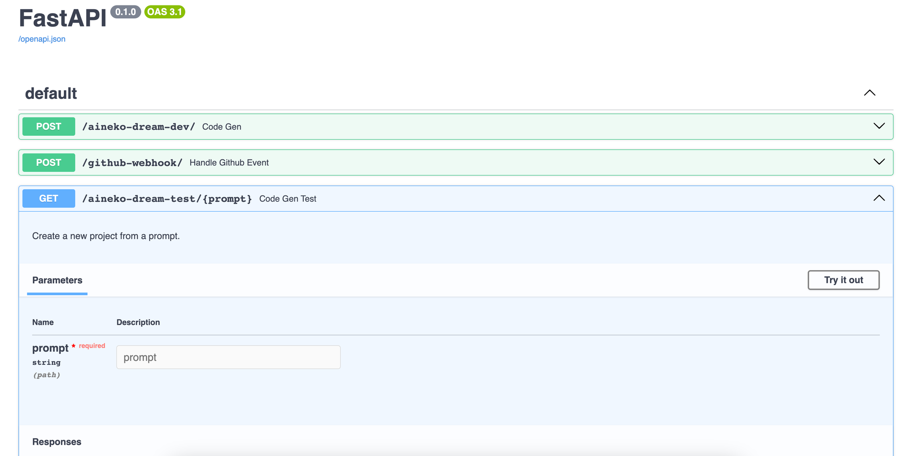

# Aineko Dream: Code Generation using ChatGPT with Real-time QA


<a href="https://github.com/aineko-dev/aineko-dream" markdown>
:fontawesome-brands-github: **View on Github**
</a>&nbsp;&nbsp;&nbsp;&nbsp;&nbsp;&nbsp;&nbsp;
<a href="https://join.slack.com/t/aineko-dev/shared_invite/zt-23yuq8mrl-uZavRQKGFltxLZLCqcQZaQ" markdown>
:fontawesome-brands-slack: **Try on Slack**
</a>

We built an app called [Aineko Dream](https://github.com/aineko-dev/aineko-dream) to test-drive [Aineko's](https://www.aineko.dev/) ability to enable generative AI features. Aineko Dream uses the [OpenAI API](https://platform.openai.com/overview) and the [Aineko docs](https://docs.aineko.dev/) to generate template code for an Aineko pipeline based on a prompt. The pipeline automatically checks the LLM response to ensure it passes some tests and either generates a prompt to fix the errors or passes the response back to the user.

This app demonstrates how you can rapidly prototype features that use foundation models by leveraging Aineko features, such as REST client connectors, stateful feedback loops, and API endpoints. Real-time QA allows us to ensure the quality of LLM responses while maintaining an interactive experience for users.

Give it a try using the Aineko Dream bot in our [Slack](https://join.slack.com/t/aineko-dev/shared\_invite/zt-23yuq8mrl-uZavRQKGFltxLZLCqcQZaQ). Or checkout the code on [GitHub](https://github.com/aineko-dev/aineko-dream).

**What will you dream up with Aineko?**

<figure markdown>
  { width="100%" }
  <figcaption><p>Aineko Dream in Action</p></figcaption>
</figure>


!!! success "Featured Unlocks"
    **Tell a Story with Your Data -** With Aineko, you retain all critical information with the context to help you tell a story in real-time and retroactively.

    _Aineko made it simple to introduce a feedback loop for real-time QA for ChatGPT responses. We keep track of response evaluation results and submit new prompts to ChatGPT to fix the errors, without any human intervention. Additionally, since we are tracking all prompts, responses, and their evaluation results, we generate a rich dataset of our app’s performance which we can use to track and improve performance._

    **Move Fast, Break Nothing -** By representing our use case as an Aineko pipeline, it was clear how we could swap building blocks in and out with ease.

    _Aineko made it easy to try out new foundation models. Once the pipeline was constructed with GPT-3 it was trivial to use GPT-4. Later, we built a second connector node for the Cohere API and used it as a drop-replacement for OpenAI. We were able to run all three models with standalone pipelines, each with its own unique API endpoint. We can use the various endpoints to route traffic for different users or use one for production and the others for development._


## Tech overview

With the Aineko framework in mind, we broke the problem down into a few key steps:

1. Fetch GitHub events
2. Update documentation used for prompt
3. Retrieve prompt from user
4. Prompt engineering
5. Query an LLM
6. Evaluate result
7. Return to step 4, or return LLM response to user

We used the following libraries and APIs to build our app.

[**FastAPI**](https://fastapi.tiangolo.com/) **&** [**Uvicorn**](https://www.uvicorn.org/)**:** Used to run an API server on Aineko and configure endpoints used by the application.

[**PyGitHub**](https://github.com/PyGithub/PyGithub)**:** Used as a client to interact with GitHub to fetch relevant documents.

[**OpenAI**](https://platform.openai.com/overview) **&** [**Cohere**](https://docs.cohere.com/docs)**:** Used to run inference using their LLMs.

[**Bandit**](https://github.com/PyCQA/bandit)**:** Used to run security tests against Python code that gets generated by the LLMs.

## The Pipeline

We start first with a simple example represented by the following diagram.



The API server accepts commit events from GitHub and prompt requests from users. The commit events trigger updates to the document that is used to engineer the LLM prompt. The engineered prompt is passed to the OpenAI API and the response is returned to the API server.

If we wanted to add a few evaluation steps to ensure that the LLMs response is valid, we can do so as shown in the following diagram.



Here we add 2 evaluation steps and an evaluation model:

* The `PythonEvaluation` node validates that the LLM proposes valid Python code.
* The `SecurityEvaluation` node runs checks using Bandit to ensure that the Python code that is proposed doesn’t contain any known security concerns.
* The `EvaluationModel` node consumes evaluation results and decides wether to generate another prompt or submit the final result to the API server. It keeps track of the evaluation results and the number of times we query the LLM.

## Pipeline Configuration

Here is the pipeline config used to generate this example. We could even configure and run three separate pipelines that use different models and expose different endpoints for each of them.

```yaml
pipeline:
  name: gpt3-template-generator

  nodes:
    # Prompt generation
    # This node can be configured to target any GitHub repo
    GitHubDocFetcher:
      class: aineko_dream.nodes.GitHubDocFetcher
      inputs:
        - github_event
      outputs:
        - document
      node_params:
        organization: "aineko-dev"
        repo: "aineko"
        branch: "documentation"
        file_path: "/docs/"
    PromptModel:
      class: aineko_dream.nodes.PromptModel
      inputs:
        - user_prompt
        - document
      outputs:
        - generated_prompt
    # LLM Client: defines model to use. Change to use another model like GPT-4
    # If we wanted to use Cohere, switch `OpenAIClient` to `Cohere`.
    GPT3Client:
      class: aineko_dream.nodes.OpenAIClient
      inputs:
        - generated_prompt
      outputs:
        - llm_response
      node_params:
        model: "gpt-3.5-turbo-16k"
        max_tokens: 4000
        temperature: 0.1
    # Response evaluation
    PythonEvaluation:
      class: aineko_dream.nodes.PythonEvaluation
      inputs:
        - llm_response
      outputs:
        - evaluation_result
    SecurityEvaluation:
      class: aineko_dream.nodes.SecurityEvaluation
      inputs:
        - llm_response
      outputs:
        - evaluation_result
    EvaluationModel:
      class: aineko_dream.nodes.EvaluationModel
      inputs:
        - evaluation_result
      outputs:
        - final_response
        - generated_prompt
			node_params:
				max_cycles: 2
    # API
    APIServer:
      class: aineko_dream.nodes.APIServer
      inputs:
        - final_response
      outputs:
        - user_prompt
        - github_event
      node_params:
        app: aineko_dream.api.main:app
        port: 8000
```

## Node Code

Here are some samples of the node code used to run this pipeline.

The `GitHubDocFetcher` emits the latest document when it initializes and updates the document based on triggers from a [GitHub webhook](https://docs.github.com/en/webhooks) that is configured to target our API server. The document is passed to the `PromptModel` to engineer a prompt based on the latest document.

```python
class GitHubDocFetcher(AbstractNode):
    """Node that fetches code documents from GitHub."""

    def _pre_loop_hook(self, params: Optional[dict] = None) -> None:
        """Initialize connection with GitHub and fetch latest document."""
        # Set parameters
        self.access_token = os.environ.get("GITHUB_ACCESS_TOKEN")
        self.organization = params.get("organization")
        self.repo = params.get("repo")
        self.branch = params.get("branch")
        self.file_path = params.get("file_path")

        # Initialize github client
        auth = Auth.Token(token=self.access_token)
        self.github_client = Github(auth=auth)

        # Fetch current document
        self.emit_new_document()

    def _execute(self, params: Optional[dict] = None) -> Optional[bool]:
        """Update document in response to commit events."""
        # Check for new commit events from GitHub
        message = self.consumers["github_event"].consume()
        if message is None:
            return

        # Fetch latest document and send update
        self.log("Received event from GitHub, fetching latest document.")
        self.emit_new_document()

    def emit_new_document(self) -> None:
        """Emit new document."""
        repo = self.github_client.get_repo(f"{self.organization}/{self.repo}")
        contents = repo.get_contents(self.file_path, ref=self.branch)
        github_contents = {f.path: f.decoded_content.decode("utf-8") for f in contents}
        self.producers["document"].produce(github_contents)
        self.log(
            f"Fetched documents for {self.organization}/{self.repo} branch {self.branch}"
        )
```

The `OpenAIClient` node creates a connection to the OpenAI API and submits requests to the configured model using the [ChatCompletion](https://platform.openai.com/docs/guides/gpt/chat-completions-api) interface. The response is passed on to the evaluation nodes.

```python
class OpenAIClient(AbstractNode):
    """Node that queries OpenAI LLMs."""

    def _pre_loop_hook(self, params: Optional[dict] = None) -> None:
        """Initialize connection with OpenAI."""
        self.model = params.get("model")
        self.max_tokens = params.get("max_tokens")
        self.temperature = params.get("temperature")
        openai.api_key = os.getenv("OPENAI_API_KEY")

    def _execute(self, params: Optional[dict] = None) -> Optional[bool]:
        """Query OpenAI LLM."""
        message = self.consumers["generated_prompt"].consume()
        if message is None:
            return
        messages = message["message"]["chat_messages"]
        # Query OpenAI LLM
        self.log("Querying OpenAI LLM...")
        response = openai.ChatCompletion.create(
            messages=messages,
            stream=False,
            model=self.model,
            max_tokens=self.max_tokens,
            temperature=self.temperature,
	      )
        message["message"]["chat_messages"].append(
            {
                "role": "assistant",
                "content": response.choices[0].message.content,
            }
        )
        self.producers["llm_response"].produce(
						message["message"]["chat_messages"]
				)
```

The `SecurityEvaluation` node takes the LLM response and creates a temporary file with the contents. We then use Bandit to run a test against the file and collect a list of issues. After cleaning up, the results are submitted to the `EvaluationModel` node.

```python
class SecurityEvaluation(AbstractNode):
    """Node that evaluates security of code."""

    def _execute(self, params: Optional[dict] = None) -> None:
        """Evaluate Python code."""
        message = self.consumers["llm_response"].consume()
        if message is None:
            return

				# Make a temporary file with the LLM code
        python_code = message["message"]
        issues_list = []
        with tempfile.NamedTemporaryFile(suffix=".py", delete=False, mode="w") as tmpfile:
            tmpfile.write(python_code)

        # Setup Bandit and run tests on the temporary file
        b_mgr = bandit.manager.BanditManager(bandit.config.BanditConfig(), 'file')
        b_mgr.discover_files([tmpfile.name], None)
        b_mgr.run_tests()

        # Store results
        results = b_mgr.get_issue_list(
            sev_level=bandit.constants.LOW,
            conf_level=bandit.constants.LOW,
            )

        # Cleanup (remove the temporary file)
        tmpfile.close()
        os.remove(tmpfile.name)

        if results:
            self.producers["evaluation_result"].produce(results)
```

## Try running locally

Visit [GitHub](https://github.com/aineko-dev/aineko-dream) for the latest version of the code and see if you can run it yourself.

You can install the app using poetry after cloning from GitHub using:

```bash
poetry install
```

First, make sure that docker is running and run the required docker services in the background using:

```bash
poetry run aineko service start

```

Then start the pipeline using:

```bash
poetry run aineko run ./conf/gpt3.yml

```

When the pipeline is live, you can visit [http://127.0.0.1:8000/docs](http://127.0.0.1:8000/docs) in your browser to interact with the endpoints via the Swagger UI.

<figure markdown>
  { width="100%" }
  <figcaption><p>Swagger UI</p></figcaption>
</figure>

## Join our Community

If you have questions about anything related to [Aineko](https://www.aineko.dev/), you're always welcome to ask our community on [GitHub](https://github.com/aineko-dev) or [Slack](https://join.slack.com/t/aineko-dev/shared\_invite/zt-23yuq8mrl-uZavRQKGFltxLZLCqcQZaQ).
